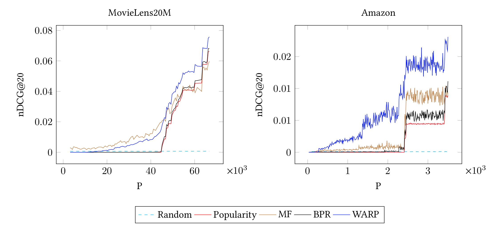
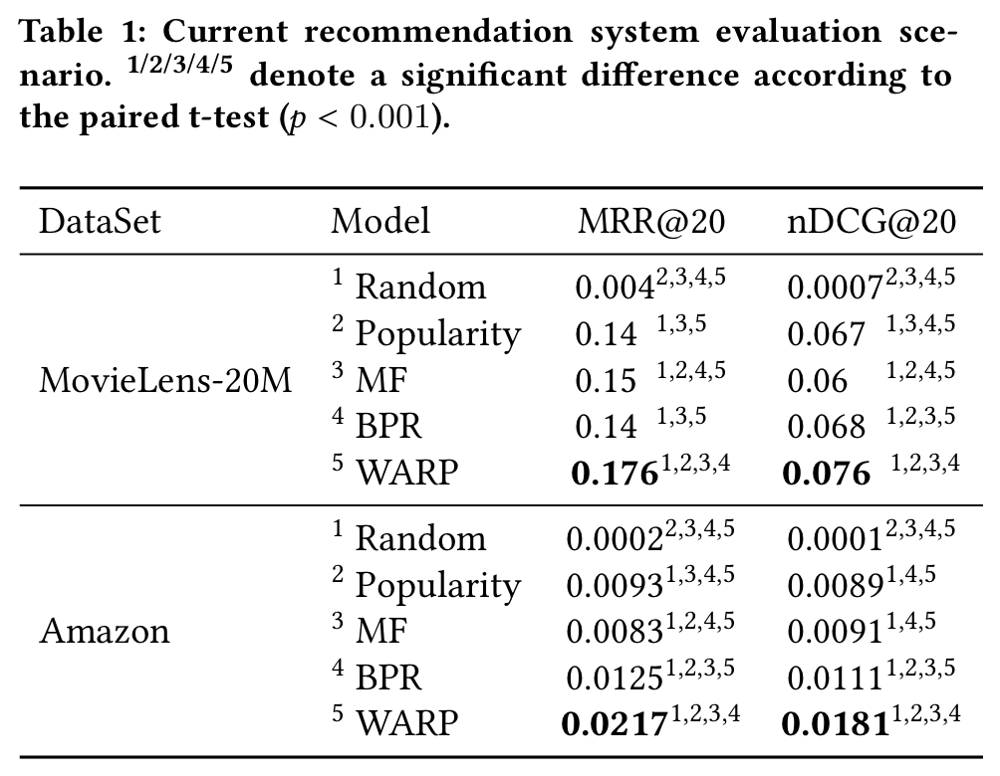

# How Sensitive is Recommendation Systems' Offline Evaluation to Popularity

This is the implementation of the following paper:

```
@InProceedings{recsys_eval19,
  author    = {Amir H. Jadidinejad and Craig Macdonald and Iadh Ounis},
  title     = {How Sensitive is Recommendation Systems' Offline Evaluation to Popularity},
  booktitle = {In Workshop on Offline Evaluation for Recommender Systems (REVEAL2019) at the 13th ACM Conference on Recommender Systems.},
  year      = {2019},
}
```

## Requirements
* [pytorch](https://github.com/pytorch/pytorch) (1.0.1)
* [spotlight](https://github.com/maciejkula/spotlight) (0.1.5)
* [pytrec-eval](https://github.com/cvangysel/pytrec_eval) (0.3)


## Results
The following plot summarizes the results of popularity-stratified sampling:



By setting P threshold to maximum, evaluation of models is corresponding to the offline recommendation system's evaluation:




See [the paper](#) for more details.

## How to reproduce?
Use [the corresponding Jupyter notebook](https://github.com/amirj/recsys_eval/blob/master/Experiments.ipynb) to reproduce the results of each dataset (MovieLens, Amazon) for a specific popularity threshold P:

